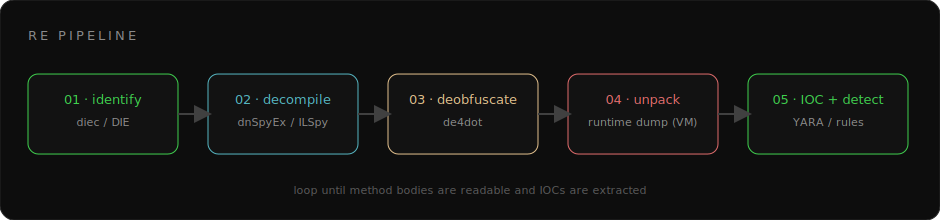
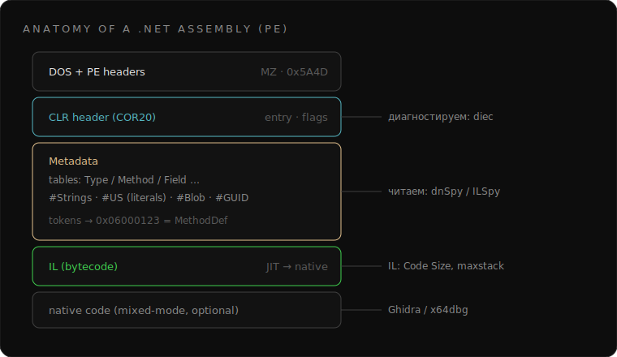
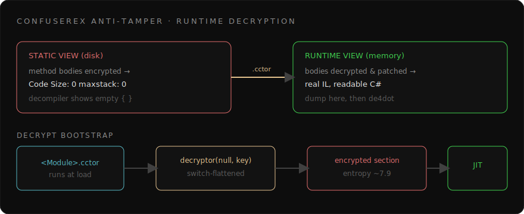

# Реверс-инжиниринг .NET: практическое руководство

Руководство о **защитном** реверс-инжиниринге .NET-сборок: как разобрать managed-бинарь, пробить обфускацию и вытащить из него индикаторы для детекта. Без воды — каждая глава завязана на реальный инструмент и его настоящий вывод. Подача образовательная: анализ ради понимания и защиты, а не ради обхода лицензий.



Весь процесс — это конвейр из пяти шагов выше. Дальше разбираем каждый на реальных командах и выводах.

---

## Глава 1. Зачем и в каких рамках

Реверс .NET нужен в трёх легальных сценариях:

- **Malware analysis** — разобрать вредоносный сэмпл, понять поведение, вытащить C2 и построить детект.
- **CTF / research** — задачи на reversing, изучение защит и форматов.
- **Defensive engineering** — проверить устойчивость своих бинарей к вскрытию.

> ⚖️ Работаем только с тем, что разрешено: свои сборки, CTF/лаборатория, образцы из песочницы. Анализ для детекта — да; воспроизведение вредоносной функциональности — нет.

---

## Глава 2. Инструментарий

Минимальный набор, который закрывает 95% задач:

| Категория | Инструмент | Зачем |
|---|---|---|
| Идентификация | **Detect It Easy** (`diec`) | тип файла, протектор, версия CLR |
| Декомпиляция | **dnSpyEx**, **ILSpy** | IL → C#, отладка managed |
| Деобфускация | **de4dot**, **de4dotEx** | renaming, строки, control-flow |
| Нативный код | **Ghidra**, **x64dbg**, **rizin** | mixed-mode, VMProtect |
| Строки/ресурсы | **rabin2**, `strings` | C2, импорты, PDB-пути |
| Детект | **yara** | сигнатуры по находкам |

Первый шаг любого анализа — `diec`. Реальный JSON-вывод по .NET-лоадеру:

```json
{
  "detects": [{
    "filetype": "PE64",
    "values": [
      { "type": "library", "name": ".NET", "version": "4.0, CLR 4.0.30319" },
      { "type": "library", "name": "Costura.Fody" },
      { "type": "linker",  "name": "Microsoft Linker" }
    ]
  }]
}
```

Здесь видно: 64-битная .NET 4.0 сборка, ресурсы упакованы через **Costura.Fody** (встроенные DLL лежат сжатыми внутри). Протектор DIE не назвал — его детект .NET-протекторов слабый, поэтому дальше проверяем вручную (глава 6).

---

## Глава 3. Анатомия .NET-сборки

.NET-бинарь — это PE-файл с **CLR-заголовком** (`COR20`), который указывает на managed-метаданные и IL.



Ключевые части:

- **Metadata tables** — описания типов, методов, полей. Каждый элемент адресуется **токеном**: `0x06000123` — это `MethodDef` (таблица `0x06`, индекс `0x123`).
- **Кучи (heaps):** `#Strings` (имена), `#US` (user strings — строковые литералы), `#Blob`, `#GUID`.
- **IL** — байткод методов; JIT компилирует его в нативный при первом вызове.

Сигнатура метаданных — строка `BSJB` в начале стрима метаданных; по ней YARA отличает .NET от нативного PE.

---

## Глава 4. От IL к C#

Декомпилятор не «знает» исходник — он реконструирует C# из IL. Полезно уметь читать IL напрямую: на сложной обфускации декомпилятор C# падает и молча отдаёт пустое тело, а IL остаётся честным.

Дамп IL одного метода по токену (dnSpy.Console, язык — IL по GUID):

```bash
dnspy.console.exe -l a4f35508-691f-4bd0-b74d-d5d5d1d0e8e6 --md 0x0600050C sample.exe
```

Нормальный метод выглядит так:

```c
.method private hidebysig instance void auth_client () cil managed {
    // Header Size: 12 bytes
    // Code Size: 134 (0x86) bytes
    .maxstack 4
    IL_0000: ldarg.0
    IL_0001: call instance string Auth::get_token()
    ...
    IL_0085: ret
}
```

А вот тот же метод в **защищённой** сборке:

```c
.method private hidebysig instance void auth_client () cil managed {
    // Header Size: 0 bytes
    // Code Size: 0 (0x0) bytes
    .maxstack 0
}
```

`Code Size: 0` при валидном RVA — тело метода **физически отсутствует** в статике. Это не баг декомпилятора, это anti-tamper (глава 6).

---

## Глава 5. Обфускация: что бывает

| Приём | Что делает | Как лечится |
|---|---|---|
| **Symbol renaming** | имена → `a`, `7E26BEA6` | de4dot восстанавливает осмысленные |
| **String encryption** | литералы зашифрованы | de4dot расшифровывает (вызывая декриптор) |
| **Control-flow flattening** | линейный код → switch-диспетчер | de4dot собирает блоки обратно |
| **Anti-tamper** | тела методов зашифрованы | нужен рантайм-дамп (глава 7) |
| **Anti-debug** | проверки отладчика | патч / ScyllaHide |

Control-flow flattening узнаётся мгновенно: линейная логика превращается в бесконечный цикл с `switch` по «состоянию»:

```csharp
for (;;) {
    switch ((num = <Module>.a(num)) % 7u) {
        case 0u: goto IL_07;
        case 1u: num = (int)(num2 * 81144519u ^ 2359132411u); continue;
        case 6u: array[i] = (byte)(addr >> i * 8 & 255u); continue;
    }
    return array;
}
```

de4dot разворачивает это обратно в обычный `for`.

---

## Глава 6. ConfuserEx и anti-tamper

Самый частый протектор. Его **anti-tamper** шифрует тела всех методов и расшифровывает их в памяти при старте — инициализатором модуля `<Module>.cctor`.



Сигнатура бутстрапа в IL `<Module>.cctor`:

```c
.method private hidebysig specialname rtspecialname static void .cctor () cil managed {
    IL_0000: newobj    instance void A18C621D::.ctor()
    IL_0005: ldnull
    IL_0006: ldc.i4    3299482        // 0x325A9A — ключ
    IL_000B: call      instance object A18C621D::'2412FFBC'(object, int32)
    IL_0010: pop
    IL_0011: ret
}
```

Именно поэтому статика показывает `Code Size: 0`: настоящий IL лежит зашифрованным в отдельной секции высокой энтропии, а оригинальные RVA указывают на пустышки. Сам расшифровщик (`A18C621D`) — switch-диспетчер на десятки веток с `uint32[]`-ключами и XOR/shr/not.

> 🔎 **Детект:** `<Module>.cctor` → создаёт один рантайм-класс и зовёт его метод с числовым ключом + секция энтропии ~7.9 = ConfuserEx anti-tamper.

---

## Глава 7. Распаковка

### Вариант A — статический de4dot
Если протектор «ванильный» ConfuserEx, форк `de4dotEx` снимает control-flow и строки. Запуск:

```bash
dotnet de4dot.dll -f sample.exe -o clean.exe --dont-rename
```

Но на кастомном/пропатченном ConfuserEx (частый случай у коммерческих сэмплов) увидите:

```text
Detected Unknown Obfuscator (sample.exe)
ERROR: Error during cflow deobfuscation of A18C621D::... 
```

«Unknown» означает, что сигнатура не совпала — anti-tamper de4dot не развернёт. Важно: при расшифровке констант de4dot **исполняет** код сэмпла, поэтому запускать его — **только в VM**.

### Вариант B — рантайм-дамп (только в VM)
Единственный надёжный путь для anti-tamper:

1. Запустить сборку под отладчиком (dnSpy), дать `<Module>.cctor` расшифровать тела в памяти.
2. Снять дамп модуля **сразу после** расшифровки (dnSpy → *Save Module*, или MegaDumper / pe-sieve).
3. Прогнать дамп через de4dot → читаемый C#.

> ⚠️ Шаг 1 исполняет реальный код — только в изолированной VM/песочнице.

---

## Глава 8. Кейс: разбор .NET-лоадера

Пройдём цепочку целиком на обезличенном примере.

**1. Идентификация.** `diec` → PE64, .NET 4.0, Costura.Fody, протектор не определён.

**2. Декомпиляция.** Открываем в dnSpyEx — у всех методов пустые тела. Дамп IL подтверждает `Code Size: 0`. Вывод: anti-tamper.

**3. Подтверждение протектора.** `<Module>.cctor` показывает паттерн `newobj <Runtime>::.ctor(); call <Runtime>::decrypt(null, key)` — ConfuserEx.

**4. Строки и метаданные.** Часть артефактов читается и без распаковки:

```bash
strings64 -n 8 loader.exe | rg 'https?://|/api/|\.pdb'
# C:\Users\dev\source\repos\Loader\obj\Release\Loader.pdb
# https://dist.example.zone
# /api/ping
```

PDB-путь сразу даёт имя пользователя сборки (`dev`) и имя проекта — сильный атрибуционный пивот.

**5. Сертификат.** Если модуль подписан — забираем подпись как IOC:

```powershell
$s = Get-AuthenticodeSignature 'loader.dll'
$s.SignerCertificate | Format-List Subject, Issuer, Thumbprint, SerialNumber
# Subject    : CN=...    Thumbprint : E2D88DAB...   Serial : 1A5F2E30...
```

**6. Распаковка.** В VM запускаем под dnSpy, брейк на выходе из `<Module>.cctor`, *Save Module* → de4dot на дампе → читаемый C#: виден auth-флоу (token + ID на `/api/ping`).

---

## Глава 9. Извлечение IOC и YARA-детект

Что вытаскиваем:

- **Сетевое:** C2-домены/URL, эндпоинты, формат auth.
- **Атрибуция:** PDB-пути, имена проектов, code-signing сертификат (subject, thumbprint, serial).
- **Поведение:** имена нативных экспортов, persistence, инжект.

Правило по устойчивым строкам и сигнатуре протектора:

```yara
rule dotnet_confuserex_loader
{
    meta:
        author      = "LMDtokyo"
        description = "ConfuserEx-protected .NET loader — defensive detection"
    strings:
        $bsjb = "BSJB"                       // .NET metadata
        $c2   = "https://dist." ascii wide
        $cfx  = "ConfuserEx" ascii nocase
    condition:
        uint16(0) == 0x5A4D and $bsjb and 1 of ($c2, $cfx)
}
```

Сигнатуру сертификата (thumbprint/serial) добавляем в блок-лист, сам сертификат репортим в CA на отзыв — это бьёт по корню операции сильнее, чем правки кода.

---

## Глава 10. Этика и закон

- Работаем **только** с авторизованными целями: свои сборки, CTF, образцы из песочницы.
- Цель — понимание и детект, а не обход защиты ради пиратства или атаки.
- Находки по вредоносам передаём в платформу / CERT / CA по легальным каналам.

---

## Приложение. Шпаргалка команд

```bash
diec -j file.exe                                   # идентификация (JSON)
dnspy.console.exe -o out/ file.exe                 # декомпиляция в проект
dnspy.console.exe -l <IL-guid> --md 0x06000123 f   # дамп IL одного метода
dotnet de4dot.dll -f file.exe -o clean.exe         # деобфускация
rabin2 -zz file.exe | rg 'http|\.dll|\.pdb'        # строки → IOC
yara rules.yar ./samples/                           # прогон детекта
```

---

## Заключение

Реверс .NET — это пайплайн: **идентифицируй → декомпилируй → деобфусцируй → распакуй → вытащи IOC**. Обфускация лишь поднимает стоимость анализа: renaming снимается за секунды, anti-tamper требует рантайм-дампа — но и он проходится. Главный навык — читать IL и не верить декомпилятору на слово.
