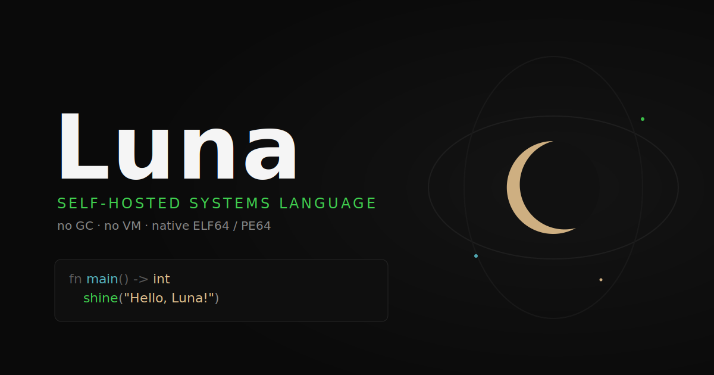
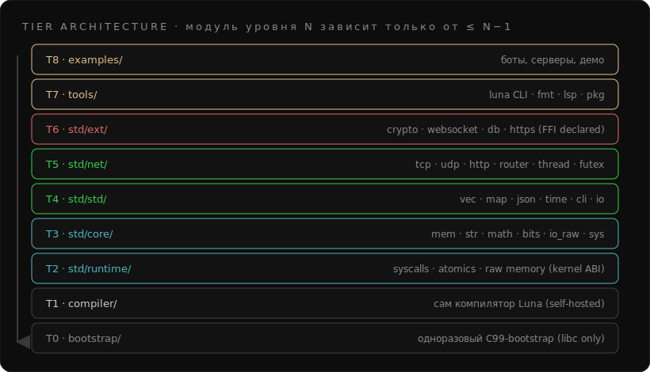
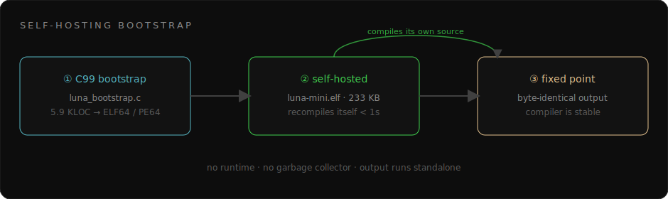

# Luna — язык, который я пишу сам

Уже какое-то время я в свободное время делаю свой язык — **Luna**. Идея простая до наглости: системный язык для математики, памяти и всякого низкоуровневого ковыряния, но без сборщика мусора и без виртуальной машины. Компилятор написан на самой Luna и собирает сам себя, а на выходе получаются обычные нативные бинари — такие, что их можно спокойно открыть в `objdump` и не найти там никакого рантайма. Код лежит тут: [github.com/LMDtokyo/Luna](https://github.com/LMDtokyo/Luna).

Сразу оговорюсь: это не игрушка «hello world на выходных». Язык уже тянет сетевые серверы и даже живого Telegram-бота. Дальше расскажу, где я сейчас и что реально работает.

## Где я сейчас

С 20 апреля Luna стала самокомпилируемой — для подмножества, которым можно заменить C. Это для меня был главный рубеж: маленький компилятор `luna-mini.elf` (около 233 КБ) берёт свои же исходники и пересобирает себя обратно в **тот же самый бинарь, байт в байт**. Когда это впервые сошлось, я понял, что фундамент держит.

Дальше я двигаюсь майлстоунами; сейчас вожусь с Windows-бэкендом (PE64) — там ещё ловлю баг с кодом возврата. Если коротко по состоянию:

- C-bootstrap — около 5.9 тысяч строк на C99, нужен ровно один раз, чтобы поднять язык.
- Сам компилятор уже на Luna, self-host сходится в fixed point.
- Linux (ELF64) работает уверенно; Windows (PE64), Mach-O и ARM64 — в разной степени готовности.
- Тестов набралось прилично: 53 на компилятор и больше трёхсот на стандартную библиотеку.

## Почему такой странный синтаксис

Мне хотелось, чтобы язык был немного «свой». Поэтому ключевые слова космические: `shine` печатает, `orbit` крутит циклы, `phase` разбирает варианты, `seal` и `meow` объявляют переменные. А ещё все runtime-значения я помечаю собачкой — `@x`. Это не украшение, `@` — часть имени; так сразу видно, где живое значение, а где тип или константа.

## С чего всё начинается

Классика:

```rust
# hello.luna
fn main() -> int
    shine("Hello, Luna!")
    return 0
```

А вот FizzBuzz, где я уже дёргаю `write(2)` напрямую — между мной и ядром нет вообще ничего:

```rust
extern "linux_syscall" fn sys_write(@fd: int, @buf: int, @n: int) -> int

fn main() -> int
    let @i = 1
    while @i <= 15
        if @i == 15
            sys_write(1, "FizzBuzz!\n", 10)
        @i = @i + 1
    return 0
```

## Что язык уже умеет

За последние майлстоуны Luna перестала быть просто «C с другими словами». Появились алгебраические типы и pattern matching (`Option` и `Result` живут прямо в языке), дженерики, замыкания и лямбды, указатели на функции, структуры — по значению и по указателю. Завёл даже borrow checker, чтобы ловить ошибки владения, и сворачивание констант на этапе компиляции. Ошибки парсера теперь показывают `строку:колонку` и честно падают с кодом 1, а не делают вид, что всё нормально.

## Память и низкий уровень

Это, наверное, моя любимая часть. Указатели типизированные, и с памятью можно работать в лоб:

```rust
meow @v: int = 10
seal @p: *mut int = &@v
*@p = 99                       // пишем по указателю

u8_set(@buf, 0, 0x7f)
shine_int(u8_at(@buf, 0))      // 127
shine_int(popcount(0xFF))      // 8
```

Есть весь джентльменский набор для байтов и битов — `u8..u64_at` с парными `_set`, `bswap`, `popcount`, `clz`/`ctz`, ротейты. Float считается через SSE. А под капотом — bump-аллокатор без блокировок (атомарный `LOCK XADD` по вершине кучи) и арены: помечаешь точку и потом откатываешь всю память разом, без утечек.

## Потоки

Потоки настоящие, через `clone(2)`:

```rust
thread_spawn(worker, @arg)
```

Синхронизация — на `futex`, плюс под рукой целый список сисколлов: сокеты, `mmap`, `mprotect`, `getrandom`, `execve`, пайпы. Всё, что нужно, чтобы писать что-то осмысленное, а не только считать числа.

## Как я разложил стандартную библиотеку

Тут я набил шишек. В какой-то момент у меня было **три разных `json.luna`** и модуль `http`, который втихаря форкал `curl`. Надоело — и я ввёл строгие уровни (тиры) от T0 до T8: модуль с уровня N может звать только то, что ниже. Низкие уровни (T2–T5) — это чистые сисколлы, без всякого FFI и шелла. За соблюдением следит линтер, и если я где-то схитрю — CI краснеет.



На чистой Luna уже написаны JSON, строки, map, CLI-парсер, base64, url, time, key-value хранилище — и почти всё с тестами. Сетевой слой тоже свой: TCP, UDP, DNS-резолвер, HTTP-клиент и сервер, роутер с путями вида `/users/:id`, парсер multipart. Из тяжёлого — sha256/sha512 с HMAC и websocket по RFC.

## Сеть — и тут самое интересное

Вот честный HTTP-сервер целиком на Luna, без FFI, прямо из репозитория:

```rust
import http_server

fn handle(@req: HttpRequest, @cli: int) -> int
    if str_eq(@req.path, "/") == 1
        return http_send_text(@cli, "Hello, Luna!\n")
    if str_eq(@req.path, "/health") == 1
        return http_send_text(@cli, "ok\n")
    return http_send_404(@cli)

fn main() -> int
    shine("Luna HTTP server on http://127.0.0.1:8080/")
    return http_serve(8080, handle)
```

А это кусок настоящего Telegram-бота. Он сидит на long-poll, отвечает на `/start`, `/help`, `/echo`, `/stats`, и счётчик сообщений переживает перезапуск, потому что лежит в key-value хранилище:

```rust
import https
import json
import kvstore

fn tg_get_updates(@token: int, @offset: int) -> int
    @method = str_concat("getUpdates?offset=", int_to_str(@offset))
    @method = str_concat(@method, "&timeout=20")
    let @r: HttpResponse = tg_call(@token, @method)
    if @r.status != 200
        return ""
    return @r.body
```

Есть ещё чат-сервер с авторизацией и сессиями — и, кстати, на арен-памяти он держит двести запросов без единого килобайта роста RSS. Этим я доволен.

## Hot-swap — правка кода на живую

Давно хотел такое: менять функцию в уже работающем процессе, не перезапуская его. Если собрать бинарь с `--hotswap`, в нём появляется таблица функций, и каждый вызов идёт не напрямую, а через слот с указателем. Я могу прислать новые байты функции по Unix-сокету — рантайм выделит свежую R+X страницу и атомарно подменит указатель. Те вызовы, что уже на стеке, доживают на старом коде, новые уходят на новый. По духу это как горячее обновление в Erlang, только для нативного языка без всякой VM.

```rust
fn hot_listen(@socket_path: int) -> int
fn hot_install_patch(@name: int, @code: int, @code_len: int) -> int
```

## Как оно само себя собирает



Логика такая: крошечный C-компилятор поднимает язык один раз, дальше Luna компилирует саму себя, а то, что результат совпадает байт в байт, доказывает, что компилятор стабилен. На практике это две команды:

```bash
bash src/bootminor/selfhost_build.sh                  # пересобрать компилятор
./src/bootminor/luna-mini.elf hello.luna -o hello.elf
./hello.elf                                            # Hello, Luna!
```

## Инструменты вокруг

Чтобы этим было удобно пользоваться, я сделал CLI (`luna build/run/new`), простенький пакетный менеджер поверх git (`luna pkg add/list/sync`) и расширение для VS Code с подсветкой. Тестов на всё про всё — больше трёхсот, плюс десяток сквозных (E2E), которые реально поднимают сервер и стучатся в него.

## Куда я хочу это привести

Большая цель — дотянуть Luna до уровня, на котором можно спокойно писать серверы и боты, как на Go или C#: нормальная работа с сетью, БД, памятью. Часть фундамента под это уже заложена — например, набросок нативного BTree-хранилища и дизайн TLS. Ближайшее — добить Windows.

В сумме Luna прошла путь от шести тысяч строк C-bootstrap до языка, который компилирует сам себя и держит живой веб-сервер. Мне нравится, что тут видно весь путь — от сисколла до самокомпиляции, без магии под капотом. Если интересно покопаться: [github.com/LMDtokyo/Luna](https://github.com/LMDtokyo/Luna).
